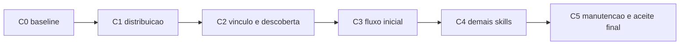

# Nextstep — plano de correções por instalação vinculada

> Atualização de 2026-09-25: a distribuição/ativação de skills no workspace foi substituída por cópias na library e preset Next Step do Skills Manager. Ver [plano vigente](skills-manager-migration-plan.md) e [manutenção](skill-distribution.md). Evidências de links locais abaixo são históricas.

| Campo | Valor |
|---|---|
| ID / revisão | NXT-PLAN-001 / 0.3 — 2026-09-24 |
| Base | NXT-SPEC-001 revisão 0.2 |
| Estado | Execução: C-0 a C-5 aceitos; P-1 aplicado e aguardando repetição do probe após reinício do Codex Desktop |
| Autoridade | O usuário autorizou a execução integral e determinou links, sem cópias, para skills e ferramentas. |

## Objetivo e aceitação

Uma sessão nova na instância privada deve descobrir as skills, executar Nextstep e selecionar os dados corretos, usando uma única árvore do produto. Alterações nessa árvore devem chegar ao consumidor sem copiar ou reinstalar payload. Primeiro corrigir e validar o produto com fixtures; depois aplicar a integração no projeto privado.

Esta revisão substitui as tarefas de instalação/empacotamento e manutenção da revisão 0.2 preservada no apêndice. O C-0 permanece evidência histórica, não prova do candidato atual. C-1 a C-5 seguiram especificação detalhada, revisão independente, implementação e QA; seus registros por ciclo são a evidência. P-1 foi aplicado após C5-G.

Aceite: zero cópias de skills ou ferramentas; CLI executável fora do checkout; skills e referências resolvidas por links; edição na fonte visível sem reinstalar; descoberta comprovada em sessão nova; seleção da instância explícita; nenhuma mutação de carreira pelo instalador; remoção da integração nunca remove seus alvos.

## Evidências e questões

Baseline inicial: `package.json` declarava o bin sem instalador, havia uma skill monolítica em `skills/nextstep`, `src/config.mjs` resolvia argumento > ambiente > descoberta ancestral e o doctor não verificava instalação/skills. C1-C5 substituíram esse estado; os registros por ciclo documentam o candidato atual.

Inspeção de 2026-09-24: comando ausente no PATH da sessão; skill ausente nos destinos examinados; execução absoluta de doctor na instância real saudável; caminho de workspace declarado diferente do diretório existente. Esses achados não reproduzem o pedido original no outro hospedeiro. Não registrar caminhos pessoais no produto: a aplicação privada resolve e registra esses valores apenas localmente.

Codex Desktop é alvo do piloto relatado e precisa de evidência própria, separada do Codex CLI. Anti-Gravity CLI é o segundo host suportado; suporte de outra IDE não é inferido desses testes. Destinos e tipos de link foram confirmados por testes sintéticos e pela aplicação P-1.

## Decisões de instalação

1. Uma raiz de produto selecionada explicitamente fornece CLI, launchers, skills e referências. Sem cópia, npm global que copie payload, hardlinks, clone implícito ou atualização Git pelo instalador.
2. No Windows, testar primeiro junctions de diretório: um diretório de comandos do usuário aponta para o diretório de launchers do produto; cada skill exposta aponta para seu diretório completo no produto. O launcher Windows é código versionado do produto e chama Node preservando cwd, argv, stdin, stdout, stderr e exit code. Não gerar um launcher copiado no perfil. Resolver a raiz física do produto para que imports relativos funcionem através do link.
3. Acrescentar ao PATH do usuário somente a entrada de comandos gerenciada, por operação explícita e recuperável. Não alterar PATH de máquina, instalar Node/Holoself ou modificar execution policy. Testar resolução em shell/processo novos; o processo desktop já aberto pode exigir reinício. Sem promessa de atualização automática do ambiente de processos existentes.
4. Um único registro de instalação por usuário guarda raiz real, destinos, tipos de link, identidade/propriedade e compatibilidade. Metadados e configuração são arquivos locais permitidos; não são cópias do produto. Não guardar isso apenas em `.nextstep/`.
5. Skills têm fonte única e destinos por hospedeiro. Preferir exposição no projeto privado para limitar ativação; evitar exposição global e local simultânea da mesma skill. Um adaptador sem suporte comprovado a links é declarado não suportado, sem fallback para cópia.
6. O vínculo privado usa configuração mínima durável (nome proposto `nextstep.yaml`), identidade da instância e referência à instalação local. Caminhos absolutos específicos da máquina ficam em metadados locais não versionados. A configuração compartilhável não deve quebrar outra máquina sincronizada.
7. Precedência de dados preservada: argumento > ambiente > descoberta ancestral. Na descoberta, o marcador mais próximo determina a instância; marcador inválido interrompe, sem escapar para outra raiz. Preservar descoberta por layout existente e informar sua origem; não criar aliases de comandos ou modelos legados.
8. Editar conteúdo da fonte é atualização esperada: mostrar revisão/hash atuais e última evidência validada separadamente. Retargeting inesperado de link é conflito. Links não congelam código; mudança de branch ou edição durante validação invalida o candidato. Hash igual de versão textual não basta.
9. CLI reflete a fonte na próxima invocação. Skills podem ser cacheadas: validar mudança em sessão nova/recarga suportada, nunca prometer mudança retroativa da conversa. Skill e motor devem reportar incompatibilidade observável sem inventar contratos.
10. Holoself permanece instalação externa. Nextstep somente verifica seu CLI público; não copia, vincula nem gerencia seu código ou dados canônicos.

## Premissas

| ID | Dimensão | Premissa verificável e resposta à falha |
|---|---|---|
| A1 | Dados | Modelo privado existente é legível; instalação não exige migração. Se exigir, separar o escopo antes de aplicar. |
| A2 | Ambiente | Raiz de produto estável e Node disponível; links funcionam com usuário comum. Se falhar, diagnosticar, sem cópia ou elevação silenciosa. |
| A3 | Fronteiras | Hospedeiro lê links e referências. Se não, marcar integração não suportada e rever adaptador. |
| A4 | Estado | Registro local durável suporta exclusão mútua curta, recuperação e comparação antes de cada escrita. Concorrência/conflito falha preservando arquivos. |
| A5 | Falhas | Operações interrompidas são retomáveis ou reversíveis; não se assume atomicidade entre PATH, configuração e vários links. |
| A6 | Escopo | Sem runtime de LLM, mudanças de domínio, publicação, cópia de ferramentas ou migração de dados pessoais. |
| A7 | Testes | Fixtures sintéticas para mutação; inspeção real apenas leitura no piloto. Permissão de host ausente significa `not_run`, não aprovação. |

## Etapas e critérios de aceite

| Etapa | Comportamento entregue / áreas | Aceite e nível de teste | Porte / impacto | Dependência |
|---|---|---|---|---|
| C-1 | Instalação de CLI por link; manifesto, launcher Windows, rotas públicas de integração | Integração em perfil isolado: comando funciona fora do checkout, preserva canais/argv/exit code; conteúdo alterado e substituído por rename na fonte aparece sem relink; ausência de cópias; caminhos com espaços | M / perfil de ferramentas | C-0 histórico + baseline atual |
| C-2 | Vínculo da instância, links de skills, bootstrap e doctor de integração | Unitário/integração: precedência, subdiretório, marcador inválido, destino físico, referência completa, duplicatas, link quebrado, runtime incompatível e PATH ausente têm resultados distintos; configuração sobrevive à reconstrução sintética do runtime | L / configuração e descoberta | C-1 |
| C-3 | `nxt-context` e `nxt-application`, reaproveitando referências atuais | E2E em sessões novas: descoberta e corpus inicial conforme protocolo abaixo; mudar skill sintética e observar conteúdo novo em outra sessão, sem reinstalar | M / comportamento dos agentes | C-2 |
| C-4 | `nxt-opportunity`, `nxt-networking`, `nxt-review` | E2E e regressão: networking sem candidatura obrigatória; rascunho sem evento; estratégia opcional; ausência de duplicatas da antiga skill | M / cobertura de intenções | C-3 |
| C-5 | Relink, verificação, desvínculo e recuperação completos | Integração adversarial: colisão, link adulterado/quebrado, concorrência, interrupção em cada etapa e fonte movida; remover links preserva árvore-alvo e canários; suíte completa no candidato integrado | L / segurança da instalação | C-4 |
| P-1 | Aplicar produto validado ao projeto privado | Confirmar raiz real do workspace; preview concreto; vincular CLI/skills por operações públicas; preservar AGENTS/Holoself; validar doctor e descoberta em sessão nova no desktop e demais hosts alvo | M / ambiente pessoal | C-5 aceito e instrução para aplicação |

A sequência preserva os ciclos existentes. O primeiro teste arriscado é a viabilidade do launcher e dos links no host real, com dados sintéticos. Recuperação básica acompanha C-1/C-2; C-5 completa a matriz adversarial, não deixa instalações intermediárias sem rollback. Fonte e configuração são mantidas separadas para que um projeto privado nunca precise de cópia ou fork do produto.

## Contratos públicos e localização do código

Sintaxe implementada: `nextstep integration plan`, `link`, `status`, `unlink`; `nextstep project plan`, `link`, `status`, `unlink`; `nextstep doctor --integration --json`. A primeira instalação pode chamar o entrypoint do produto por Node, pois o nome `nextstep` ainda não resolve. Modificações de integração usam contratos versionados, preview e revalidação antes da escrita; registros de carreira não são inventário de instalação.

| Área implementada | Camada e dependência | Fronteira |
|---|---|---|
| `src/integration.mjs` | Planejamento, registry, links, PATH, journals e inventário de host | Não coordena agentes nem importa dados privados |
| `src/instance-config.mjs` | Marcador durável e ownership do vínculo do projeto | Separado de `.nextstep/` e do modelo de carreira |
| `src/cli.mjs`, `src/command-catalog.mjs` | Interface CLI importa casos de uso e compõe drivers | Rotas e contratos públicos |
| `src/config.mjs` | Resolução recebe configuração validada | Domínio não depende do instalador |
| `src/commands.mjs` e diagnóstico de integração | Composição de resultados de saúde | Dados, executável, links e host reportados separadamente |
| `bin/` e `launchers/windows/` | Driver Windows/Node versionado no produto | Import/exec pela raiz física, sem cwd fixo |
| `skills/nxt-*/` e referências | Conteúdo do produto | Agentes externos consomem CLI, nunca módulos internos |

Doctor reporta disponibilidade do motor, resolução do executável, origem da instância, integridade dos links, compatibilidade e estado da evidência de descoberta/ativação. Uma verificação de filesystem não pode retornar ativação comprovada. Diagnóstico de instalação deve funcionar sem vault e sem Holoself; diagnóstico de dados continua separado. Erros incluem ação corretiva, sem reparo automático.

## Aplicação no projeto privado (P-1)

1. Inspecionar o workspace efetivamente aberto e o diretório existente; confirmar identidade da instância por leitura. Corrigir referência obsoleta do ambiente apenas no mecanismo que a possui. Não mover o vault para satisfazer um caminho antigo.
2. Registrar estado anterior de PATH, instruções, configuração e links, sem copiar dados de carreira. Apresentar preview dos destinos e alvos antes da aplicação.
3. Vincular instalação à árvore validada do produto, com comando público. Criar somente metadados e links necessários, sem ferramentas, dependências ou payload duplicado no vault.
4. Manter `AGENTS.md` privado como arquivo próprio e byte-preservado. A decisão detalhada de C2 expõe as instruções por links nos diretórios nativos dos hosts, tornando desnecessário inserir um bloco Nextstep no arquivo. Nunca substituir `AGENTS.md` por link nem duplicar ali a skill; preservar o bloco Holoself existente.
5. Abrir sessão nova: resolver comando no próprio hospedeiro; descobrir skills; verificar raiz/subdiretório; realizar uma tarefa de contexto somente leitura. Reiniciar o aplicativo se necessário para novo PATH. Não concluir usando apenas o shell do instalador.
6. Comparar hashes dos arquivos privados abrangidos antes/depois; somente configuração/instruções/links planejados podem mudar. Não registrar evento real como teste. Entregar estado por hospedeiro e procedimento de recuperação.

## Requisitos não funcionais

| Área | Decisão / meta verificável |
|---|---|
| Segurança | Usuário comum; alvo real validado; zero remoções recursivas através de links; não alterar arquivo sem propriedade e estado esperado. Testar canários fora da raiz. |
| Privacidade | Zero registros pessoais em fixtures, logs públicos ou repositório do produto; caminhos pessoais somente em metadados locais. |
| Desempenho/capacidade | Diagnóstico de integração não percorre o vault; examina apenas inventário, links e manifesto de arquivos do produto. Reportar duração sem inventar SLA. |
| Confiabilidade | Idempotência; journal durável de instalação; injeção de falha em cada fase; estado recuperável após todas as interrupções testadas. |
| Observabilidade | JSON por componente com origem, destino, erro e ação; `passed/failed/not_run` na evidência. Hash atual separado do último validado. |
| Operação | Preview, link, status, relink e unlink; rollback restaura só metadados/links/PATH próprios. Atualização da fonte é externa ao instalador. |
| Compatibilidade | Esquemas explícitos; incompatibilidade não seleciona outra fonte. Sem aliases antigos. Alterações de conteúdo invalidam evidência, não provocam cópia ou relink automático. |
| Custo | Sem serviços, chamadas de LLM ou rede em instalação/doctor. Orçamento de avaliações definido antes de cada bateria; limite não transforma pendência em aceite. |
| Usabilidade/acessibilidade | CLI com erro acionável e JSON estável; nenhuma UI nova, portanto WCAG visual não aplicável. |
| Manutenção/testabilidade | Testes puros do plano de operações e integração sintética; referências das skills testadas através dos links. |
| Portabilidade | Windows é alvo inicial; Node mínimo confirmado pelos testes. OneDrive não é transporte de instalação: outra máquina recria links locais, sem assumir sincronização de junctions. |

## Qualidade, recuperação e condições de execução

Antes de desenvolver: registrar estado Git e hashes das alterações preexistentes, inclusive bin e documentos não rastreados; não incorporar mudanças alheias. Rever contratos públicos, propriedade de links/PATH, precedência e recuperação independentemente. Registrar decisões arquiteturais sobre instalação vinculada, configuração local versus compartilhável e validade da evidência quando a fonte muda.

Cada ciclo termina com relatório contendo comandos, resultados, hashes, versão do host, limitações e output resumido na conversa. Testes específicos serão criados com nomes confirmados na implementação; não apresentar comandos futuros como existentes. Checks existentes finais: `npm test`, `npm run check`, `git diff --check`. Baseline antiga não substitui execução atual.

O gate comportamental vigente é a emenda C3-A: matriz 2 × 2 para as duas skills iniciais, negativos por host, handoff real entre hosts e smokes das três skills de C4. O corpus de 10 positivos + 5 negativos × 3 repetições permanece protocolo opcional de caracterização do host/modelo, sem bloquear o produto. Codex Desktop tem evidência própria; execução CLI não o certifica. QA é externo ao produto e usa fixtures, sem Nextstep lançar agentes.

Rollback: remover somente link cujo destino e propriedade ainda correspondam ao registro, sem percorrer o alvo; restaurar entradas próprias de PATH e metadados mediante comparação; preservar conteúdo concorrente e reportar conflito. Desvincular não reverte edições na fonte. Se a fonte foi removida, diagnóstico e recuperação devem continuar possíveis pelo instalador disponível ou runbook de remoção exata de links. Não executar `git reset`, apagar checkout, limpar vault ou reinstalar cópias como recuperação.

Condições mensuráveis por ciclo (limites são checkpoints de coordenação, não garantias de duração):

- **C-1:** CLI vinculada funciona de perfil isolado e reflete substituição de fonte. Exibir resultado dos testes de launcher/link e `npm run check`; parar/replanejar se A2 falhar ou após 20 turnos de execução sem gate fechado.
- **C-2:** fixtures resolvem raízes e destinos corretamente; cada falha de integração tem diagnóstico distinto. Exibir tabela de casos e resultados; nenhum registro privado alterado. Parar se A3/A4/A5 falhar ou após 25 turnos.
- **C-3:** duas skills descobertas por links e corpus inicial aprovado. Exibir denominadores por host e evidência de atualização sem reinstalar; parar se A7 falhar ou após 20 turnos, com avaliação pendente explícita.
- **C-4:** cinco skills passam corpus e regressão, sem duplicatas/aliases. Exibir resultados por skill/host; parar após 20 turnos ou violação de integridade.
- **C-5:** todas as falhas injetadas são recuperáveis, remoção preserva alvos/canários, checks existentes passam no candidato identificado. Exibir outputs; parar se A4/A5 falhar ou após 25 turnos.
- **P-1:** sessão nova do projeto real usa produto e skills vinculados, com leitura bem-sucedida e zero mudanças de carreira. Exibir checklist sanitizado e diferenças permitidas; parar se A1/A2/A3 falhar, autorização de aplicação faltar ou após 10 turnos.

P-1 foi aplicado por comandos públicos, sem cópias. O primeiro probe Desktop passou descoberta, ativação, referências, launcher absoluto e integridade, mas o processo aberto antes da instalação não herdou o novo PATH. Resta reiniciar o aplicativo e repetir a resolução bare `nextstep`. Uma colisão ou host sem suporte exige decisão sobre destino/escopo, nunca fallback para cópia.

## Apêndice histórico — revisão 0.2, substituída

O texto abaixo é preservado como histórico de planejamento. Suas propostas de pacote/cópias, estados temporais e relatos de revisão não são autoridade para executar a revisão 0.3. Os registros C-0 separados continuam evidência histórica. As seções acima regem o trabalho futuro.

# Nextstep — plano de implementação coordenada (histórico)

| Campo | Valor |
|---|---|
| ID | NXT-PLAN-001 |
| Revisão | 0.2 — 2026-09-19 |
| Base | [NXT-SPEC-001](portable-product-spec.md), revisão 0.1 |
| Estado | Plano consolidado após revisões Claude e Grok; implementação não iniciada |
| Autoridade | Esta solicitação autoriza planejamento e revisões externas. Desenvolvimento, instalação pessoal e publicação aguardam instruções. |

## 1. Contrato de leitura e execução futura

A especificação define o produto; este documento define tarefas, dependências, responsáveis por modelo e evidências de conclusão. Seus seis ciclos são C-0 a C-5. As especificações detalhadas produzidas em cada ciclo refinam os contratos existentes; divergências arquiteturais voltam ao coordenador antes de desenvolvimento.

Todo agente lê esta seção, a política de modelos e apenas seu ciclo, mais os requisitos R-* e aceites AC-* referenciados na especificação. Antes de execução futura, o coordenador fixa commit de origem, alterações locais preservadas, versões das ferramentas e hashes dos documentos. Mudanças existentes não entram implicitamente no trabalho.

Cada tarefa recebe: ID; objetivo; entradas e versões; dependências; arquivos exclusivos; interfaces compartilhadas congeladas; modelo e esforço; operações autorizadas; testes exigidos; formato de retorno. Retorna evidências, arquivos, resultados, limitações e conflitos. O estado segue `pending → ready → running → review → passed`; `blocked` e `failed` não contam como concluído.

As tarefas abaixo são futuras, inclusive testes e criação de fixtures. As consultas de revisão registradas na seção 7 são as únicas atividades de agentes executadas para preparar este plano.

## 2. Coordenação, modelos e custo

O coordenador Codex responde pela decomposição, contratos compartilhados, conferência de evidências e gates. Um parecer de modelo nunca substitui resultado de teste. Todo ciclo segue **especificação detalhada → Claude independente → desenvolvimento → testes finais independentes → aceite do coordenador**. Alteração material de contrato retorna ao Claude antes de continuar.

| Código | Modelo e execução proposta | Uso e limite |
|---|---|---|
| CO | GPT-6 Astra, high, no Codex | Coordenação, conflitos arquiteturais e aprovação dos gates; reservado a decisões com consequências transversais. |
| LE | Gemini 3.8 Flash, medium, via `agy` | Leitura extensa, inventários e mapas de referências com caminhos/linhas. Deve devolver evidência localizada, não apenas síntese. |
| AR | Gemini 3.1 Pro, high, via `agy` | Escalonamento de leitura com contratos contraditórios ou relações complexas. |
| RV | Claude Sonnet 4.6 Thinking, via `agy` | Revisão independente de cada especificação detalhada e cobertura dos testes. Sessão nova, sem assumir conclusões do autor. |
| CX | Claude Opus 4.6 Thinking, via `agy` | Escalonamento do RV para ambiguidade sobre perda de dados, recuperação ou limites de autoridade. |
| DV | GPT-5.6 Terra, medium, no Codex | Implementação delimitada de configuração, instalação e testes. Escalonar a high se houver concorrência ou recuperação complexa. |
| LT | GPT-5.6 Luna, medium, no Codex | Templates, documentação, casos tabelados e mudanças mecânicas sob contrato congelado. |
| QA | GPT-5.6 Sol, high, no Codex | Testes finais, investigação de falhas e auditoria do pacote em sessão independente do implementador. |
| GR | Grok 4.6, CLI `grok` | Contestação final do plano completo; não é executor nem autoridade de aceite dos testes. |

Os IDs Gemini/Claude e Grok foram confirmados nos CLIs locais em 2026-09-19. Os modelos Codex são opções declaradas pelo ambiente; validar disponibilidade no despacho. Essas classes de custo são heurísticas de alocação, **não preços ou economia medidos**. Antes da execução, registrar tarifa/quota quando disponível; se não houver, registrar tokens, chamadas e duração sem inventar custo monetário.

Regra econômica: leitura ampla vai ao LE pelo `agy`; CO recebe mapa resumido e trechos decisivos. LT só recebe tarefas com entrada/saída verificável e baixo risco. Uma falha de evidência permite uma correção no mesmo modelo; segunda falha com a mesma causa escala ao modelo adequado. Risco de dados escala imediatamente. Não repetir uma avaliação até obter um resultado favorável; todos os resultados integram o relatório. Estabelecer orçamento por ciclo antes do despacho; orçamento esgotado deixa trabalho pendente, não aprovado.

Independência: RV não escreve a especificação que revisa; QA não testa apenas casos fornecidos pelo implementador. QA deriva casos também dos AC, adiciona negativos e verifica o candidato exato integrado. LE e implementadores não recebem dados pessoais como contexto padrão.

Nas tarefas S, DV redige a partir do mapa LE; CO decide apenas ambiguidades e contratos transversais e assina o texto para RV. AR é escalonamento de LE, não chamada obrigatória. CX aplica-se a qualquer ciclo com risco de dados ou autoridade, especialmente C2-R/C3-R. Após duas revisões sem resolver a mesma causa, CO reavalia o contrato com CX antes de novo desenvolvimento; conservar todos os pareceres.

## 3. Contratos comuns e gates

### 3.1 Conteúdo obrigatório de cada especificação detalhada

Cada tarefa `Ck-S` produz, dentro do registro de execução futuro do ciclo: objetivo e exclusões; IDs R/AC; comandos e envelopes de entrada/saída; esquemas e versões; precedência; erros e efeitos colaterais; propriedade de arquivos; compatibilidade; tabela de exemplos válidos/inválidos; recuperação; testes e dados sintéticos. Para componentes sem CLI, especificar interface equivalente. A sintaxe nova só se torna normativa após `Ck-R` e aceite CO.

O Claude entrega uma tabela `finding_id | severidade | contrato/AC | evidência | correção | teste esperado`, além de `approved` ou `changes_required`. Bloqueantes incluem possibilidade de dados errados, sobrescrita, interface ambígua ou aceite não mensurável. O autor corrige; Claude reavalia o texto alterado. CO registra a resolução de cada achado; todos os achados precisam estar resolvidos ou explicitamente fora do escopo com justificativa. Nenhum bloqueante pode ser dispensado por média de qualidade.

### 3.2 Evidência e conclusão

Cada teste registra ID, baseline/candidato, hash do pacote, fixture, comando/prompt, versões de SO/host/modelo/skill, saída ou referência de log, oráculo e `passed/failed/not_run`. Separar observação de agente de asserção automática. O resultado deve poder ser reproduzido por outro agente sem o histórico da conversa.

Fixtures são versionadas com hash e recriadas por caso em destino temporário exclusivo. Cenários sequenciais declaram a sequência como integração; nenhum caso herda estado de outro implicitamente. QA verifica geradores e teardown delimitado ao destino sintético, incluindo preservação de arquivos sentinela externos.

Em C2-S, definir a tabela de degradação: executável ausente impede operações do motor; configuração inválida impede seleção/mutação da instância; skill ausente impede alegar integração ativa; Holoself indisponível permite apenas tarefas sustentadas por contexto já autorizado, com limitação explícita, e bloqueia afirmações que dependem de evidência ausente. Diagnóstico permanece disponível onde tecnicamente possível. Erros estruturados e testes usam essa mesma tabela.

Um gate fecha quando: contrato revisado; requisitos do ciclo cobertos; testes obrigatórios passaram; nenhuma falha ou revisão bloqueante aberta; CO conferiu os artefatos e impacto sobre ciclos anteriores. Teste obrigatório indisponível mantém o gate aberto. Mudança posterior invalida os testes afetados e exige novo candidato identificado.

Todos os gates registram hash do candidato/documentos; C3-G e C4-G aplicam expressamente os limiares da seção 3.3. Oráculos usam eventos, arquivos, hashes, códigos de erro e ausência de efeitos proibidos; uma impressão narrativa não basta. Regressão de C-3 em C-4 bloqueia C4-G e reabre o aceite afetado de C-3.

### 3.3 Avaliação de skills e ambientes

Em C-0 definir matriz exata SO × versão do host × modelo consumidor × versão do produto. Prioridade: Windows, Codex e Anti-Gravity CLI com Gemini. IDE entra somente se confirmado como ambiente necessário; CLI não prova IDE. A falta da tarefa original fica registrada como diagnóstico não reproduzido; um cenário sintético permite evoluir o produto, sem alegar que explica o incidente.

Antes de C-2 congelar o protocolo e os oráculos técnicos de descoberta. Congelar os prompts comportamentais específicos em C3-S e C4-S, antes de desenvolvimento e avaliação de cada conjunto: por skill, 10 prompts positivos e 5 negativos, três execuções em sessões novas por combinação suportada. Corpus inclui paráfrases, pedidos ambíguos, raiz/subdiretório e contexto insuficiente. Exigir ≥90% de ativação adequada dos positivos por skill/combinação (pelo menos 27 de 30 tentativas positivas) e zero mutações indevidas ou eventos inventados nos negativos e demais cenários. Toda violação de integridade/privacidade bloqueia independentemente da taxa. Reportar denominadores e variação; esse limite é um gate de engenharia, não prova estatística de confiabilidade geral.

Descoberta técnica em C-2 é determinística: nome, destino, versão, hash e ausência de duplicata. Avaliação comportamental inicia em C-3 e estende em C-4. Nos cinco fluxos finais, são 225 execuções por combinação; com duas combinações são 450. Cada execução inclui evidência suficiente para o oráculo, sem exigir igualdade de prosa. Fixar estimativa de chamadas/tokens, duração e tamanho do corpus antes da execução; alterações no corpus requerem justificativa e rerun comparável.

Antes de cada bateria ampla, QA verifica o harness com uma skill e uma combinação. Erro de infraestrutura interrompe a expansão; o smoke não substitui o corpus obrigatório. QA supervisiona e audita resultados; as sessões consumidoras usam os modelos da matriz, não Sol high em todas as chamadas. Continuidade entre hosts usa exclusivamente perfis e instâncias sintéticos.

## 4. Tarefas por ciclo

Os nomes de arquivos abaixo indicam áreas de responsabilidade, não afirmam módulos que já existem. LE confirma o mapa atual antes de edição. Cada linha possui modelo primário; escalonamentos seguem a seção 2.

### C-0 — baseline e reprodução

Objetivo: resolver Q-01/Q-02 e preparar Q-06; delimitar o que pode ser afirmado sobre H-01/H-02. Entrada: especificação e checkout atual. Sem alterações funcionais no motor.

| Tarefa | Modelo | Escopo, saída e conclusão |
|---|---|---|
| C0-L | LE | Ler documentação, CLI, configuração, testes e skills; entregar mapa de dependências com fontes, scripts reais de teste e gaps observados. Preservar alterações existentes. |
| C0-S | DV rascunho + CO decisão | Especificar matriz de suporte, cenário original quando disponível, reprodução sintética, captura de PATH/descoberta, oráculos e corpus inicial. Distinguir reprodução de hipótese. |
| C0-R | RV | Revisar C0-S, isolamento, suficiência das evidências e critérios de falha; fechar achados antes de construir harness. |
| C0-D | DV | Desenvolver somente harness de baseline e fixtures sintéticas, captura de versões e relatório; não corrigir produto neste ciclo. |
| C0-T | QA | Executar baseline em sessões novas; testar que fixture não aponta para vault real; produzir falha reproduzida ou `not_reproduced` com limites. |
| C0-G | CO | Conferir matriz, ausência de contaminação por histórico e decisões pendentes; liberar C-1 apenas com cenário de teste reproduzível, mesmo que diferente do incidente. |

Dependências internas: L → S → R → D → T → G. Artefato de saída: baseline versionada, matriz, corpus proposto e mapa de código. Q-01 pode permanecer sem causa determinada; isso não autoriza afirmar causa-raiz.

Se C-0 refutar H-01 ou mostrar que o gap já está resolvido, CO revisa o escopo e mantém C-1..C-5 pendentes até o usuário aceitar o recorte revisado. Ausência de reprodução não equivale a confirmação nem refutação.

### C-1 — distribuição instalável

Entrada: C0-G. R-01, parte contratual de R-07; AC-01. Decisão padrão proposta para Q-03: pacote Node local, sem publicação; runtime mínimo confirmado contra manifesto e testes. Nome público e registry ficam fora do gate.

| Tarefa | Modelo | Escopo, saída e conclusão |
|---|---|---|
| C1-L | LE | Inventariar dependências em runtime, entradas bin, assets, licenças e arquivos indispensáveis; evidenciar referências ao checkout. |
| C1-S | DV rascunho + CO decisão | Especificar allowlist do pacote, manifesto de versões/compatibilidade, algoritmo de hash e inventário de propriedade. Definir desde já estados de instalação, colisão, drift e recuperação usados em C-5; falhar preservando conteúdo desconhecido. |
| C1-R | RV | Revisar pacote, bootstrapping inicial, compatibilidade e contrato de manutenção; avaliar se C-5 pode funcionar sem redesenhar C-1. |
| C1-D1 | DV | Implementar empacotamento local e manifesto; entrada CLI utilizável após instalação em destino isolado, fora da base privada. |
| C1-D2 | LT | Criar documentação e casos do inventário aprovados; só após contrato de D1 estabilizado, com ownership separado. |
| C1-T | QA | Instalar artefato em perfil limpo sem acesso ao checkout; rodar capabilities/smoke; verificar allowlist, ausência de segredos/dados privados e erros de runtime incompatível. |
| C1-G | CO | Aceitar AC-01 no hash empacotado e contrato de manutenção revisado; nenhuma publicação ou instalação pessoal. |

Sequência: L → S → R → D1 → D2 → T → G. C-1 define o formato do manifesto e a política de compatibilidade. A compatibilidade concreta entre esquema de configuração, CLI e bundle fecha em C2-G, após C2-S; comparação não se limita a strings de versão iguais. Arquivos acrescentados em C-2 reabrem a verificação da allowlist e do pacote.

### C-2 — vínculo, descoberta e diagnóstico

Entrada: C1-G. R-02/04/05/09 e descoberta técnica de R-03; AC-02/04/05 e parte técnica de AC-03. Resolver Q-04/Q-05 e definir o protocolo Q-06 antes do desenvolvimento.

| Tarefa | Modelo | Escopo, saída e conclusão |
|---|---|---|
| C2-L | LE | Ler resolução atual e documentação oficial das versões dos hosts; mapear PATH por processo, locais de skills e bootstrap. |
| C2-S | DV rascunho + CO decisão | Especificar esquema mínimo `nextstep.yaml`, identidade da instância, precedência argumento > ambiente > marcador ancestral; marcador inválido próximo falha fechado. Definir vínculo/desvínculo, política explícita de marcador antigo, cópias gerenciadas versus links e erros JSON. |
| C2-R | RV | Revisar ambiguidades, raiz errada, junctions/symlinks, diretórios sincronizados, dados fora do destino, Holoself indisponível e compatibilidade. |
| C2-D1 | DV | Implementar resolução/configuração/vínculo por interface pública, validação antes de escrita e relatório de origem; domínio privado intacto. |
| C2-D2 | DV | Após contratos de D1 congelados, implementar adaptadores e instalação em perfis sintéticos; ownership separado. Registrar hashes e detectar colisões e duplicidade. |
| C2-D3 | LT | Implementar mensagens e documentação de diagnóstico a partir da tabela de erros; não modificar lógica compartilhada. |
| C2-T | QA | Executar precedência, instâncias aninhadas, marcador inválido, paths com espaços, contenção de links, duplicatas, ausência de executável/skill/Holoself e incompatibilidade; provar configuração preservada ao reconstruir runtime sintético. |
| C2-G | CO | Fechar AC-02/04/05 e descoberta técnica AC-03; não declarar ativação comportamental validada ainda. |

Sequência: L → S → R → D1 → D2/D3 → T → G. Ajustes em `src/config.mjs`/rotas compartilhadas têm único proprietário definido por CO. Diagnóstico reporta problemas sem repará-los silenciosamente.

### C-3 — fluxo vertical inicial

Entrada: C2-G. R-03/06/08/09/10; AC-03/06/08/09/10 no recorte inicial. Skills: `nxt-context`, `nxt-application`.

| Tarefa | Modelo | Escopo, saída e conclusão |
|---|---|---|
| C3-L | LE | Mapear skill atual e dez referências para contratos públicos; identificar conteúdo reutilizável e gatilhos sobrepostos. |
| C3-S | DV rascunho + CO decisão | Especificar ativação/encaminhamento, contexto mínimo, condições de escrita, confirmação de eventos, artefatos e falhas; fixar prompts e oráculos por skill. |
| C3-R | RV | Revisar instruções, privacidade, ausência de pipeline obrigatório e suficiência dos testes de invariantes; retornar contraprovas. |
| C3-D1 | LT | Redigir as duas skills e referências sob contrato aprovado; fonte única no produto e descrições de ativação específicas. |
| C3-D2 | DV | Integrar bundle e fixtures do fluxo vertical; usar CLI existente para mutações. Defeito de domínio exige escopo e revisão próprios, sem reescrita implícita. |
| C3-T | QA | Executar corpus nos hosts; análise sem gravação; preparação/registro autorizado; continuidade no segundo host; idempotência, revisão concorrente e snapshot imutável por hash; Holoself ausente sem acesso canônico direto. |
| C3-G | CO | Conferir evidências e taxas por combinação; fechar recorte inicial. Piloto pessoal permanece fora desta autorização. |

Sequência: L → S → R → D1 → D2 → T → G. Eventos sintéticos confirmados fazem parte do roteiro de teste; sucesso de geração de texto não vale como sucesso de persistência.

### C-4 — cobertura por intenção

Entrada: C3-G. R-03/08/10; AC-03/08/10 para as cinco skills.

| Tarefa | Modelo | Escopo, saída e conclusão |
|---|---|---|
| C4-L | LE | Mapear oportunidades, pessoas/interações, estratégias/experimentos e revisão; localizar restrições e contextos pertinentes. |
| C4-S | DV rascunho + CO decisão | Especificar `nxt-opportunity`, `nxt-networking`, `nxt-review`, gatilhos positivos/negativos e resolução de sobreposição com as duas skills existentes. |
| C4-R | RV | Revisar distinções entre oportunidade/candidatura, networking/evento confirmado, estratégia opcional e coleta mínima de contexto. |
| C4-D1 | LT | Implementar nxt-opportunity e referências exclusivas. |
| C4-D2 | LT | Implementar nxt-networking e referências exclusivas. |
| C4-D3 | LT | Implementar nxt-review; DV integra mudanças em referências compartilhadas e router sob contrato aprovado por CO. |
| C4-T | QA | Testar corpus completo, sobreposição e negativos: networking sem candidatura; análise sem registro; estratégia apenas quando selecionada/aplicável; fatos ausentes continuam ausentes. |
| C4-G | CO | Fechar cobertura das cinco skills e comparar regressões de C-3 na versão integrada. |

Sequência: L → S → R → D1/D2 → D3 → T → G. Paralelismo permitido apenas em arquivos distintos; no máximo três trabalhadores mais coordenador, sujeito ao ambiente e orçamento.

### C-5 — manutenção e prontidão

Entrada: C4-G e contrato de manutenção de C1-S. R-07 e regressão R-01..10; AC-07 e suíte final AC-01..10.

| Tarefa | Modelo | Escopo, saída e conclusão |
|---|---|---|
| C5-L | LE | Conferir implementação integrada contra inventário/compatibilidade, instalação, docs e erros; localizar estados intermediários possíveis. |
| C5-S | DV rascunho + CO decisão | Detalhar upgrade/desinstalação, lock de instalação, staging, commit/recovery, preservação de customizações e migração explícita da skill antiga apenas quando gerenciada. Definir matriz origem→destino suportada e interrupções por etapa. |
| C5-R | RV | Revisar máquina de estados e testes de falha; escalar CX se houver ambiguidade de perda de dados ou recuperação. |
| C5-D1 | DV high | Implementar manutenção segundo contrato; nenhuma remoção de arquivo sem propriedade demonstrada; drift gera conflito explícito e solução preservadora. |
| C5-D2 | LT | Finalizar instruções de instalação, suporte, migração e limites por host com comandos verificados; lista de arquivos do pacote. |
| C5-T | QA | Testar reinstalação, drift, instalação concorrente, interrupção por etapa, recuperação, upgrade incompatível e remoção; provar preservação de dados e conteúdo externo. Executar suite do repositório e todos AC no pacote candidato final, incluindo corpus completo. |
| C5-G | CO | Conferir pacote/hash, matriz real de suporte, evidências completas e pendências; entregar candidato pronto para decisão de release. |

Sequência: L → S → R → D1/D2 → T → G. Os comandos concretos de teste são descobertos em C0-L e confirmados no manifesto corrente; não inventar scripts. Publicação, rollout pessoal e limpeza de instalações existentes continuam decisões separadas.

## 5. Integração e paralelismo

CO mantém propriedade das interfaces compartilhadas e da integração. Cada despacho identifica arquivos exclusivos; mudanças em arquivo de outro agente voltam como proposta, sem edição concorrente. Worktrees/branches isoladas são uma opção após autorização de desenvolvimento; antes de usá-las, registrar baseline e destino de integração, preservando alterações existentes. Integrar uma tarefa por vez; QA verifica o resultado integrado, não somente branches individuais.

Leitura e desenho de testes podem ocorrer em paralelo quando independentes. Desenvolvimento depende da revisão Claude aprovada. Achado em ciclo posterior reabre o gate anterior afetado e limita o trabalho dependente até revisão. Nenhum agente escolhe silenciosamente outro modelo ou amplia suporte.

## 6. Critérios de encerramento do desenvolvimento futuro

Entregar: pacote local verificável; cinco skills; configuração e adaptadores; manutenção; documentação; relatório R→AC→tarefa→teste→evidência; versões suportadas e limites. Sucesso exige todos os gates C0-G..C5-G e testes no candidato final. A conformidade é do artefato testado, não uma promessa de comportamento de qualquer modelo ou host.

O próximo passo deste documento é revisão pelo usuário e instrução sobre execução. Até lá, nenhuma tarefa C0-L..C5-G está iniciada.

## 7. Revisões realizadas durante o planejamento

Claude Sonnet 4.6 Thinking, via `agy`, revisou independentemente a especificação nesta sessão. Identificou seis lacunas: contratos de instalação/manutenção, antecipação do corpus, degradação de dependências, isolamento de fixtures, ramo de refutação de H-01 e limiares comportamentais. Todas receberam tratamento neste plano (seções 3 e 4). O contrato detalhado de instalação será produzido e revisado em C1-S/C1-R antes de qualquer desenvolvimento, sem exigir desenho anterior ao próprio ciclo.

As revisões recebem texto da especificação/plano, sem dados privados; não constituem auditoria independente do código nem execução dos testes futuros. Grok 4.6 revisou o plano completo 0.1 via CLI nesta sessão e recomendou correções antes de execução. A revisão 0.2 incorpora dependências de compatibilidade, serialização de tarefas compartilhadas, congelamento progressivo do corpus, denominadores de aceite, escalonamento e alocação econômica. O parecer foi sobre o texto fornecido, sem leitura independente da especificação ou código. Após a consolidação, o plano completo 0.2 foi enviado novamente ao Grok 4.6. Parecer final: favorável à apresentação, sem bloqueantes textuais restantes. O parecer preserva os limites: não autoriza execução, não audita o código, não comprova tarifas/disponibilidade futura e não transforma o volume de avaliações em garantia estatística.

