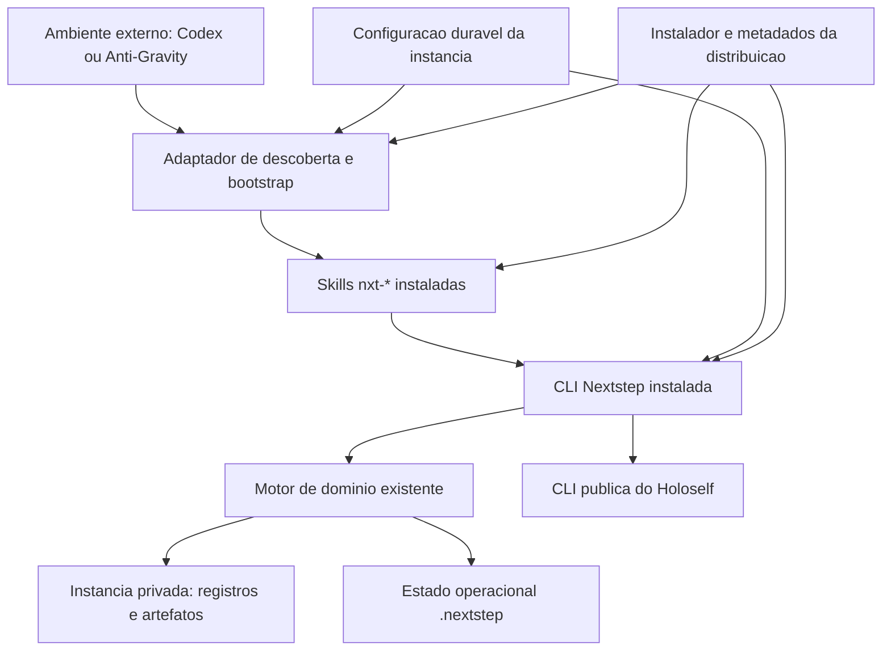
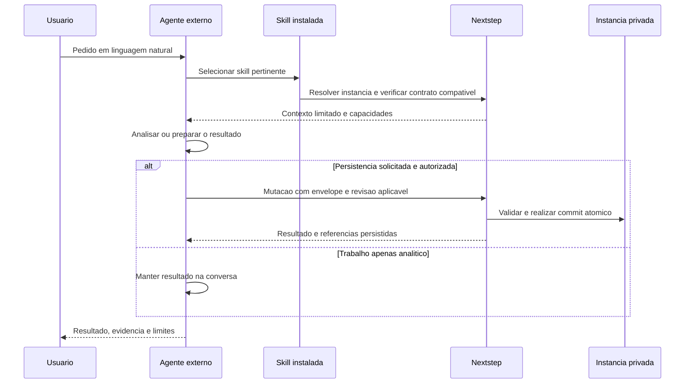

# Nextstep — especificação de produto portátil e skills instaláveis

> Atualização de 2026-09-25: a distribuição/ativação de skills no workspace foi substituída por cópias na library e preset Next Step do Skills Manager. Ver [plano vigente](skills-manager-migration-plan.md) e [manutenção](skill-distribution.md). Evidências de links locais abaixo são históricas.

| Campo | Valor |
|---|---|
| Identificador | NXT-SPEC-001 |
| Revisão | 0.2 |
| Data | 2026-09-24 |
| Estado | Produto implementado e C0-G..C5-G aceitos; P-1 aplicado, aguardando repetição Desktop após reinício para herdar PATH |
| Escopo | Distribuição do motor, skills, vínculo com dados e integração com ambientes de agentes |
| Autorização atual | Planejar correções no produto e depois na instância privada; sem implementação ou instalação nesta etapa |
| Fonte principal | Análise do código e diagnóstico local, complementados por consulta ao Gemini via Anti-Gravity |

## 1. Leitura e autoridade para agentes

Este é o documento único de especificação desta evolução. As referências externas sustentam fatos; não são especificações paralelas. Os identificadores permitem citar requisitos e evidências sem repetir o documento inteiro.

**Leitura mínima:** seções 1–4 e 10. Depois, consultar apenas as seções relacionadas à responsabilidade recebida: arquitetura em 5–6; fit-gap em 7; requisitos e aceitação em 8–9; ciclos em 11; decisões pendentes em 12.

**Tipos de afirmação:**

- `E-*`: evidência observada, limitada à data e ao ambiente da análise.
- `H-*`: hipótese que precisa de reprodução ou experimento.
- `D-*`: decisão arquitetural proposta nesta especificação, ainda sujeita à revisão.
- `R-*`: requisito do produto proposto.
- `AC-*`: critério de aceitação verificável.
- `C-*`: ciclo de desenvolvimento delimitado por resultados verificáveis.
- `Q-*`: questão aberta, com momento em que precisa ser resolvida.

Os contratos vigentes do repositório continuam regendo execução. Esta proposta não altera `AGENTS.md`, autoriza publicação ou ativa desenvolvimento. Exemplos de comandos e configurações marcados como propostos não são interfaces já disponíveis.

Para conflitos: registrar o requisito afetado, a evidência atual e a decisão necessária. Um agente não deve resolver divergências de escopo inventando autorização ou declarando uma proposta implementada.

## 2. Taxonomia: contexto, problema e solução

| Domínio | Termo | Definição e fronteira |
|---|---|---|
| Contexto | Produto Nextstep | CLI e motor de domínio instaláveis; código, contratos e skills genéricas pertencem ao repositório do produto. |
| Contexto | Instância privada | Diretório de dados de uma pessoa, como Nextstep SAM; contém registros, artefatos e políticas locais. |
| Contexto | Ambiente hospedeiro | Codex, Anti-Gravity CLI/IDE ou outro cliente que interpreta pedidos e executa ferramentas. |
| Contexto | Skill | Instruções portáteis que conectam uma intenção do usuário às capacidades do produto. |
| Contexto | Integração do ambiente | Regras de descoberta, instalação e inicialização próprias de cada hospedeiro e versão. |
| Contexto | Holoself | Produto independente que fornece contexto pessoal autorizado por sua interface pública. |
| Contexto | Estado operacional | `.nextstep/`; não é fonte canônica de evidência profissional nem local de configuração durável. |
| Problema | Descoberta | O agente não encontra a skill, o executável ou o diretório de dados correto. |
| Problema | Acoplamento acidental | O sucesso depende de caminhos locais, histórico da conversa ou conhecimento do checkout. |
| Problema | Divergência | Skill, motor, configuração e integração podem corresponder a versões diferentes. |
| Problema | Portabilidade não comprovada | Saúde do modelo de dados não demonstra sucesso de uma tarefa real em outro hospedeiro. |
| Solução | Distribuição versionada | Pacote com motor, skills e metadados de compatibilidade, instalado fora do diretório privado. |
| Solução | Vínculo explícito | Configuração mínima que identifica a instância e permite diagnosticar a conexão com o produto. |
| Solução | Ativação verificável | Instalação nos locais reconhecidos e confirmação de descoberta dentro de uma sessão nova. |
| Solução | Governança do motor | Toda mutação relacional permanece na interface determinística já existente. |

### 2.1 Problema a resolver

Uma pessoa deve conseguir abrir sua instância em um ambiente suportado e trabalhar em linguagem natural, sem explicar a arquitetura, localizar o código-fonte ou reconstruir manualmente os contratos da CLI. A troca de ambiente deve preservar dados, regras e limites de autorização.

**H-01 — hipótese principal:** faltam contratos completos de instalação, descoberta e ativação. A evidência atual sustenta essa hipótese, mas não identifica todas as causas da experiência insatisfatória relatada.

**H-02 — hipótese secundária:** skills por intenção, com descrições de ativação específicas, reduzem a dependência do conhecimento prévio do agente. Deve ser medida com sessões novas, e não presumida pela existência de arquivos Markdown.

### 2.2 Resultado e limites

O produto proposto é **motor + skills + integração instalável**. O diretório privado é uma instância consumidora. A expressão “aplicativo” significa aqui esse produto local; a proposta preserva a arquitetura vigente de CLI sem servidor, interface gráfica ou orquestrador de LLM.

Ficam fora deste escopo: redesenho do modelo de carreira, migração de conteúdo pessoal, hospedagem, sincronização distribuída, execução de agentes pelo motor, novos provedores de IA e publicação em marketplaces. MCP poderá ser avaliado separadamente se um hospedeiro prioritário exigir essa interface.

## 3. Evidências e limites do diagnóstico

| ID | Evidência | Fonte e limite |
|---|---|---|
| E-01 | Produto declara CLI neutra a agentes e motor como autoridade de mutação. | `AGENTS.md`, `README.md`, `docs/architecture.md`; consultados na análise. |
| E-02 | Manifesto observado: versão 2.0.0, `private: true`, entrada `bin` para `nextstep`. | `package.json`; não representa uma distribuição publicada ou testada em máquina limpa. |
| E-03 | Existe uma skill `nextstep` com dez referências por família de comandos. | `skills/nextstep/SKILL.md` e `references/`. |
| E-04 | Nas pastas locais examinadas do caso de uso, havia Holoself, mas não a skill Nextstep. | Inventário local de `.codex/skills`, `.gemini/skills`, `.claude/skills` e integração Anti-Gravity; não é inventário universal de todas as instalações. |
| E-05 | O shell da análise não resolveu `nextstep`; execução direta por Node retornou `doctor: healthy`. | Verificação da sessão; não demonstra o PATH de todos os hospedeiros nem valida fluxos completos. |
| E-06 | A seleção de dados usa argumento explícito, variável de ambiente e descoberta por ancestrais. | `src/config.mjs`: marcadores `Master/` e `Candidatures/records/manifest.json`. |
| E-07 | Não foram encontrados comandos de instalação, vinculação de projeto ou atualização nas rotas examinadas. | `src/cli.mjs` e documentação da CLI. |
| E-08 | Os caminhos de skills variam entre Gemini CLI e Anti-Gravity CLI; Codex também documenta `.agents/skills`. | Documentação oficial referenciada na seção 13; revalidar por versão antes de implementar adaptadores. |
| E-09 | Gemini 3.1 Pro, consultado pelo Anti-Gravity CLI, apoiou a hipótese de falta de instalação/descoberta e recomendou configuração durável separada do runtime. | Revisão do resumo de evidências enviado pelo agente principal; leitura direta foi bloqueada por permissão em modo não interativo. Não constitui auditoria independente do código. |

Falta reproduzir a tarefa que falhou no outro ambiente, registrar a seleção efetiva de skills, verificar o executável dentro daquele processo e observar sua execução ponta a ponta. O diagnóstico saudável não exclui defeitos de domínio ou comportamento do agente.

## 4. Jobs-to-be-done: três níveis

**J-0 — resultado principal:** quando trabalho minha busca profissional em qualquer ambiente suportado, quero que minha instância se conecte ao Nextstep instalado, para continuar o trabalho com contexto e histórico consistentes.

| Nível 2: trabalho | Nível 3: subtrabalho | Resultado observável |
|---|---|---|
| J-1 Preparar o ambiente | J-1.1 Instalar produto e skills | Sessão nova encontra a árvore selecionada por links, sem depender do cwd do checkout. |
| J-1 Preparar o ambiente | J-1.2 Vincular instância existente | A raiz correta é resolvida e validada sem mudar registros. |
| J-1 Preparar o ambiente | J-1.3 Diagnosticar uma falha | Relatório identifica componente, causa observada e ação recomendada. |
| J-2 Trabalhar uma oportunidade | J-2.1 Entender posição e evidências | Contexto limitado à tarefa; lacunas ficam explícitas. |
| J-2 Trabalhar uma oportunidade | J-2.2 Preparar candidatura | Rascunhos e artefatos necessários são produzidos e registrados quando solicitado. |
| J-2 Trabalhar uma oportunidade | J-2.3 Registrar fatos confirmados | Submissão, outreach ou resultado preservam proveniência e precisão temporal. |
| J-3 Manter continuidade | J-3.1 Trocar de ambiente | Outro hospedeiro lê o mesmo estado sem copiar a base privada. |
| J-3 Manter continuidade | J-3.2 Atualizar ou remover integração | Conteúdo pessoal e personalizações são preservados. |
| J-3 Manter continuidade | J-3.3 Revisar próximos passos | Estratégias e experimentos são usados quando pertinentes, sem pipeline obrigatório. |

## 5. Arquitetura proposta

### 5.1 Estado final

### 5.2 Decisões propostas

- **D-01:** decisão do usuário em 2026-09-24: instalar skills e ferramentas por links para uma única árvore do produto; nenhuma cópia ou fallback para cópia. Vincular diretórios completos de skills, incluindo referências. No Windows, junctions de diretório são a primeira opção a validar; outros tipos dependem do suporte comprovado do hospedeiro.
- **D-02:** manter `nextstep` como executável. Usar `nxt-` nos nomes das skills. Adotar `nxt-context` como entrada geral; isso aplica o prefixo consistentemente, refinando a sugestão inicial de uma skill chamada apenas `nxt`.
- **D-03:** distribuir motor e conjunto de skills com manifesto explícito de compatibilidade. Versão instalada e compatibilidade devem ser inspecionáveis sem acesso a dados privados.
- **D-04:** criar configuração durável na raiz da instância, nome proposto `nextstep.yaml`; `.nextstep/` continua operacional. O formato definitivo será resolvido antes de implementar o vínculo.
- **D-05:** priorizar instalação por usuário, sem privilégios administrativos. Adaptadores integram o mesmo conteúdo aos hospedeiros suportados e evitam duplicação de uma mesma skill na descoberta.
- **D-06:** priorizar instalação vinculada a uma árvore local escolhida explicitamente, inclusive o checkout de desenvolvimento. O instalador não clona, copia ou atualiza essa árvore. Entradas executáveis e skills pertencem ao produto e são expostas por links. Mudanças ficam visíveis na próxima invocação do CLI; skills podem exigir sessão nova ou recarga do hospedeiro. Empacotamento para distribuição futura fica fora do aceite desta correção.
- **D-07:** manter interpretação, pesquisa, redação e colaboração no ambiente externo. O produto fornece contexto e persistência determinísticos.

### 5.3 Componentes e ações

| Componente | Responsabilidade/ação | Entrega ou interface | Restrição |
|---|---|---|---|
| Distribuição | Declarar ferramentas, skills e compatibilidade da árvore única | Manifesto e revisão observável | Sem dados privados ou caminhos pessoais fixos. |
| Instalador | Criar, verificar, redirecionar e remover links gerenciados | Inventário de propriedade, destinos e hashes observados | Nunca copiar payload ou remover os alvos. |
| Adaptadores | Resolver destinos de skills e bootstrap por hospedeiro | Metadados e entradas mínimas nos locais suportados | Não duplicar regras de domínio. |
| Vínculo da instância | Identificar raiz, preferências e compatibilidade | Configuração durável validada | Sem credenciais ou cópia de contexto pessoal. |
| Skills | Traduzir intenção em uso dos contratos | `SKILL.md` e referências carregadas sob demanda | Não substituir invariantes do motor por instruções em prosa. |
| CLI/motor | Descobrir capacidades, montar contexto e persistir | Contratos JSON existentes e novos contratos de integração | Revisões, idempotência, atomicidade e snapshots preservados. |
| Diagnóstico | Explicar saúde e conexão efetiva | Resultado estruturado, origem das resoluções e correção sugerida | Diagnóstico não aplica reparos automaticamente. |
| Holoself | Resolver contexto pessoal autorizado | Interface pública existente | Autoridade própria e fronteira de privacidade preservadas. |

### 5.4 Skills propostas

| Skill | Ativação | Escopo |
|---|---|---|
| `nxt-context` | Pedido geral sobre Nextstep, contexto ou diagnóstico | Identificar instância, descobrir contratos, obter contexto e encaminhar. |
| `nxt-opportunity` | Avaliar posição ou registrar decisão | Evidências, lacunas e oportunidade; candidatura apenas quando necessária. |
| `nxt-application` | Preparar ou acompanhar candidatura | Artefatos, registro do pacote, prontidão e fatos confirmados do ciclo. |
| `nxt-networking` | Trabalhar contato, conversa ou outreach | Pessoas e interações, sem exigir ApplicationAttempt. |
| `nxt-review` | Revisar busca e próximos passos | Leitura do estado; estratégias e experimentos quando selecionados. |

O primeiro incremento funcional inclui `nxt-context` e `nxt-application`. As demais skills ampliam a cobertura depois de demonstrada a integração. Referências de comandos existentes devem ser reaproveitadas; os contratos da CLI continuam autoritativos. Migração do nome antigo deve ser explícita e limitada a instalações gerenciadas, sem aliases de compatibilidade permanentes.

## 6. Fluxos e configuração

### 6.1 Fluxo de execução de uma tarefa

“Transparente” significa descoberta e conexão automáticas após instalação e vínculo, com origem inspecionável. Não significa gravação oculta nem confirmação implícita de eventos externos.

### 6.2 Contrato de configuração

Separar três escopos: configuração da distribuição por usuário; configuração durável da instância; estado operacional. O vínculo de Holoself existente permanece a autoridade dessa integração.

A configuração de instância deve conter apenas versão de esquema, identidade estável da instância, compatibilidade requerida e preferências de integração necessárias. Quando estiver na própria raiz de dados, evitar repetir um caminho absoluto. Idioma de comunicação pode ser uma preferência; evidências, estratégias e regras de carreira permanecem nos seus contratos próprios.

A resolução deve preservar a precedência de `--data-root`, seguida da descoberta local; nenhuma variável de ambiente seleciona a raiz de dados (`NEXTSTEP_DATA_ROOT` foi removida). Acrescentar o marcador durável sem selecionar silenciosamente outro diretório quando o marcador mais próximo estiver inválido. O relatório informa a origem da escolha. Marcadores legados detectados podem apoiar um diagnóstico de migração; comportamento definitivo depende de Q-04.

Operações propostas: instalar distribuição; vincular instância existente; verificar integração; atualizar arquivos gerenciados; desvincular integração. Sintaxe ilustrativa como `nextstep project link` precisa de contrato aprovado antes de implementação. Criar uma base vazia é uma capacidade separada, ainda fora do primeiro incremento.

## 7. Fit-gap da solução atual

| Capacidade | Fit atual | Gap | Tratamento proposto | Rastreio |
|---|---|---|---|---|
| Separação produto/dados | Forte, explícita no contrato | Integração depende de conhecimento do ambiente | Preservar fronteira e instalar fora da instância | E-01, R-01 |
| Persistência governada | Motor já contém mecanismos necessários | Regressões possíveis na nova integração | Reutilizar e testar a interface pública | E-01, R-06 |
| Contexto e descoberta de comandos | CLI já fornece contratos | Agente precisa encontrar o executável primeiro | Bootstrap mínimo e diagnóstico da resolução | E-05, R-02 |
| Skills reutilizáveis | Router e referências existentes | Instalação e prefixo não consolidados | Bundle por intenção com cobertura rastreável | E-03/04, R-03 |
| Distribuição independente | Entrada `bin` existente | Pacote não validado como produto distribuível | Manifesto, conteúdo mínimo e instalação limpa | E-02, R-01 |
| Configuração | Raiz por argumento, ambiente e ancestrais | Sem vínculo durável explícito e ciclo de manutenção | Configuração de instância e migração controlada | E-06, R-04 |
| Saúde | `doctor` validou a instância examinada | Não prova descoberta no hospedeiro | Diagnóstico de integração e teste em sessão nova | E-05, R-05 |
| Atualização/desinstalação | Não identificadas nas rotas examinadas | Risco de sobrescrita e deriva | Inventário de arquivos, detecção de alterações e recuperação | E-07, R-07 |
| Portabilidade entre ambientes | Intenção arquitetural existente | Ausência de aceite ponta a ponta observado | Matriz de ambientes e cenários sintéticos | E-08, R-08 |
| Contexto pessoal | Integração pública com Holoself existente | Dependência externa pode ficar indisponível | Reportar indisponibilidade e limitar tarefa ao contexto disponível | E-01/05, R-09 |

## 8. Requisitos verificáveis

| ID | Requisito | Critério associado |
|---|---|---|
| R-01 | Expor ferramentas e skills por links para uma árvore explícita do produto, sem cópias, hardlinks ou dependência do cwd do checkout. | AC-01 |
| R-02 | Resolver executável e instância em sessão nova e em subdiretório; tornar explícita a origem da resolução. | AC-02 |
| R-03 | Instalar skills `nxt-*` compatíveis, com ativação delimitada e sem duplicidade por hospedeiro. | AC-03 |
| R-04 | Manter configuração durável fora do runtime, validada por esquema e independente de caminhos pessoais fixos. | AC-04 |
| R-05 | Diagnosticar separadamente instalação, descoberta, compatibilidade, dados e Holoself. | AC-05 |
| R-06 | Usar o motor para mutações; preservar histórico transmitido, revisões e idempotência. | AC-06 |
| R-07 | Atualizar e remover apenas arquivos gerenciados; detectar customizações e permitir recuperação de atualização interrompida. | AC-07 |
| R-08 | Demonstrar tarefas equivalentes em Codex e Gemini via Anti-Gravity com sessões novas. | AC-08 |
| R-09 | Manter conteúdo privado fora da distribuição e respeitar a interface autorizada do Holoself. | AC-09 |
| R-10 | Manter análise sem persistência e eventos dependentes de confirmação; evitar workflow obrigatório. | AC-10 |

## 9. Aceitação e evidência de validação

Todos os testes de mutação usam instâncias sintéticas isoladas. A inspeção da instância real pode corroborar diagnóstico, mas não substitui fixtures reproduzíveis.

| ID | Cenário e condição de sucesso |
|---|---|
| AC-01 | Vincular árvore sintética do produto em perfil limpo; executar `capabilities` a partir de outro diretório. Verificar destinos reais, ausência de cópias e referências completas. Editar e substituir por rename arquivos sintéticos de CLI/skill: a próxima leitura vê a mudança sem reinstalação. Alvo ausente falha claramente, sem fallback para cópia. |
| AC-02 | Abrir sessão nova na raiz e em subdiretório; ambas resolvem a instância esperada. Testar overrides explícitos e marcador inválido; não selecionar outra instância silenciosamente. |
| AC-03 | Cada hospedeiro declara ou demonstra descoberta de exatamente uma instalação de cada skill prevista; nome, versão e hash correspondem ao bundle. Pedido pertinente ativa a skill; pedido alheio não inicia fluxo de carreira. |
| AC-04 | Instalar e vincular fixture, reconstruir estado operacional em condições seguras e confirmar preservação da configuração. Atualização de esquema inválida falha sem alteração parcial. Não executar limpeza do runtime real como teste. |
| AC-05 | Simular executável ausente, skill ausente, versão incompatível e Holoself indisponível; cada caso produz causa distinta e recomendação acionável sem mutar dados. |
| AC-06 | Registrar pacote sintético, repetir a operação com mesma chave e testar revisão concorrente; não duplicar registros nem sobrescrever versão conflitante. Snapshot transmitido mantém os mesmos bytes após nova revisão. |
| AC-07 | Revincular ao mesmo alvo é idempotente. Alteração do conteúdo da fonte é atualização esperada e invalida evidência anterior; alteração do destino do link é drift e gera conflito. Simular interrupção de relink; instalação anterior permanece utilizável ou recuperável. Remoção apaga somente links comprovadamente gerenciados, preservando alvos, dados, PATH alheio e arquivos externos. |
| AC-08 | Em sessões novas de cada ambiente alvo, sem histórico desta conversa: analisar oportunidade sem gravar; preparar/registrar pacote autorizado; continuar leitura no segundo ambiente. Comparar invariantes e estado final, não igualdade de prosa. |
| AC-09 | Inspecionar manifesto, alvos vinculados e logs de teste; usar apenas dados sintéticos. Indisponibilidade do Holoself não leva a leitura direta de seus arquivos canônicos ou invenção de evidências. |
| AC-10 | Pedido analítico não cria registros; rascunho pronto não registra envio. Networking não exige ApplicationAttempt; estratégia só rege a tarefa quando aplicável. |

Cada relatório de aceite deve identificar commit e hashes da árvore vinculada, versão da skill, sistema operacional, hospedeiro e versão, modelo quando aplicável, fixture, comando ou prompt, resultado observado e status `passed`, `failed` ou `not_run`. Resultados automáticos e observações do agente ficam separados. Não declarar suporte a um ambiente apenas porque a criação de links funcionou.

## 10. Contrato de colaboração para planejamento futuro

Esta seção prepara o contexto para múltiplos agentes; não distribui tarefas nem inicia execução.

### 10.1 Responsabilidades possíveis

| Responsabilidade | Área de decisão | Fronteira de escrita sugerida para planejamento |
|---|---|---|
| Distribuição | Pacote, manifesto e instalação | Arquivos de distribuição e respectivos testes. |
| Integração | Resolução, vínculo e adaptadores | Configuração/bootstrap e respectivos testes. |
| Skills | Intenções, referências e cobertura | Conteúdo de skills e avaliações de ativação. |
| Validação | Cenários transversais e evidências | Fixtures e testes de aceitação; revisão de resultados. |
| Integração final | Compatibilidade e coerência entre entregas | Contratos compartilhados e decisão de integração. |

O planejamento posterior define propriedade exclusiva dos arquivos compartilhados e dependências antes de paralelizar alterações. Modelo de dados e contratos de configuração não podem evoluir em versões divergentes por agentes diferentes.

### 10.2 Pacote mínimo de delegação

Uma tarefa futura deve receber: objetivo limitado; IDs de requisitos e aceite; seções necessárias deste documento; baseline/commit; arquivos sob sua responsabilidade; interfaces congeladas; dependências; ações autorizadas; evidência exigida para conclusão.

O retorno deve conter: arquivos alterados; requisitos atendidos; testes executados e não executados; evidência; hipóteses remanescentes; conflitos; condição para integração. Uma conclusão sem evidência de aceite é incompleta.

### 10.3 Invariantes transversais

- Motor é a única autoridade de escrita relacional; agentes trabalham sobre sua interface pública.
- Instância privada, configuração durável e runtime têm fronteiras distintas.
- Aprovação da especificação, planejamento, implementação, instalação pessoal e publicação são escopos distintos.
- Mudanças existentes no checkout são preservadas; ownership é verificado antes de editar ou integrar.
- Registro de envio exige fato confirmado; contexto disponível não equivale a aprovação de divulgação.
- Agentes de implementação usam fixtures sintéticas e não recebem a base pessoal como contexto padrão.

## 11. Ciclos validáveis de desenvolvimento

Os ciclos definem escopo e gates de saída. Não são cronograma, backlog executável ou autorização para desenvolvimento autônomo.

| Ciclo | Escopo incluído | Fora do ciclo | Saída verificável / dependência |
|---|---|---|---|
| C-0 Baseline e reprodução | Fixar versões e ambiente alvo; reproduzir falha ou documentar que não foi reproduzida; mapear instalação/descoberta atual. | Reparos implícitos e mudanças de domínio. | Evidência para H-01/H-02; Q-01 e Q-02 resolvidas; matriz de suporte delimitada. |
| C-1 Instalação vinculada | Manifesto, launcher e links; smoke fora do checkout; alteração da fonte sem reinstalar. | Integração pessoal e publicação. | AC-01; alvos e compatibilidade definidos; depende de C-0. |
| C-2 Vínculo e descoberta | Configuração durável, adaptadores prioritários, diagnóstico e bootstrap mínimo. | Novos fluxos de carreira. | AC-02, AC-04, AC-05 e descoberta técnica de AC-03; depende de C-1 e Q-03/Q-04. |
| C-3 Fluxo vertical inicial | `nxt-context` e `nxt-application`, referências e tarefa sintética completa nos dois hospedeiros. | Demais skills e ampliação de suporte. | AC-03, AC-06, AC-08, AC-09 e AC-10 para o recorte inicial; depende de C-2. |
| C-4 Cobertura por intenção | `nxt-opportunity`, `nxt-networking`, `nxt-review`; cenários e limites de ativação específicos. | Reescrita do motor ou pipeline obrigatório. | AC-03/08/10 estendidos a todas as skills propostas; depende de C-3. |
| C-5 Manutenção e prontidão | Relink, desvínculo, conflitos, interrupções e documentação de recuperação. | Publicação e rollout pessoal. | AC-07 e aceites afetados na árvore candidata final; depende dos ciclos anteriores. |

Cada gate exige resultados observados, limitações explícitas e zero falhas não resolvidas nos requisitos incluídos. `not_run` mantém o gate aberto quando o critério é obrigatório. O piloto privado P-1 do plano revisão 0.3 ocorre após C-5 e instrução de aplicação. O produto completo desta especificação inclui C-4 e C-5.

## 12. Questões abertas e riscos

| ID | Questão / decisão necessária | Momento limite | Direção recomendada |
|---|---|---|---|
| Q-01 | Qual tarefa falhou e em qual hospedeiro/versão? | C-0 | Reproduzir sem memória prévia; distinguir IDE de CLI. |
| Q-02 | Qual matriz inicial de suporte? | C-0 | Windows + Codex + Anti-Gravity CLI com Gemini; incluir IDE se for o ambiente do caso original. Não presumir paridade. |
| Q-03 | Modo de instalação e runtime? | Modo decidido em 2026-09-24 | Links para árvore local; Node externo, versão mínima a validar. Registry fora do escopo. |
| Q-04 | Esquema, formato e migração do marcador de instância? | Antes de C-2 | Configuração durável mínima; migração explícita, sem aliases legados permanentes. |
| Q-05 | Como expor skills e ferramentas? | Links decididos pelo usuário em 2026-09-24 | Validar junctions/symlinks por host; nunca fallback para cópia. |
| Q-06 | Critério de repetição das avaliações de agentes? | Antes de C-3 | Definir conjunto fixo de prompts e execuções independentes; registrar variabilidade e falhas. |

Riscos principais: PATH diferente por processo; alteração dos caminhos de descoberta pelos fornecedores; skills duplicadas; divergência entre bundle e motor; atualizações sobrescrevendo personalizações; resolução da instância errada; avaliações de LLM não determinísticas. Os controles são, respectivamente, diagnóstico no hospedeiro, matriz versionada, inventário de instalação, contrato de compatibilidade, detecção de drift, precedência explícita e evidência por execução.

## 13. Fontes e proveniência

Fontes de código relativas à raiz do produto: `AGENTS.md`, `README.md`, `package.json`, `src/config.mjs`, `src/cli.mjs`, `skills/nextstep/SKILL.md`, `skills/nextstep/references/`, `docs/architecture.md` e `docs/development.md`.

Documentação externa consultada em 2026-09-19:

- [OpenAI — Build skills](https://learn.chatgpt.com/docs/build-skills): descoberta e distribuição de skills no Codex.
- [Google — Migrating from Gemini CLI](https://antigravity.google/docs/cli/gcli-migration/): diferenças entre caminhos de skills e configuração no Gemini CLI e Anti-Gravity CLI.

A consulta ao Gemini foi uma revisão arquitetural de evidências fornecidas, sem acesso efetivo ao código nessa execução. A proposta adota sua recomendação de instalação/diagnóstico e separação da configuração, mas substitui nomes técnicos como `nxt-mutate` por intenções de uso. Nenhuma conclusão externa substitui testes de aceite.

**Próximo estado esperado:** reiniciar o Codex Desktop e repetir o probe na instância privada para confirmar resolução bare `nextstep`. Descoberta e ativação Desktop já passaram; C-0 a C-5 estão aceitos e P-1 usa apenas links.
